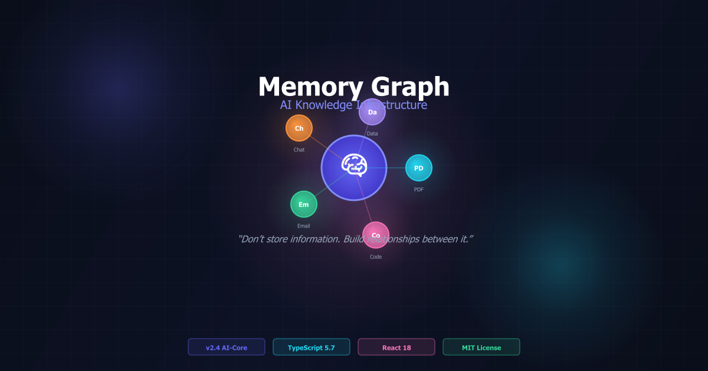
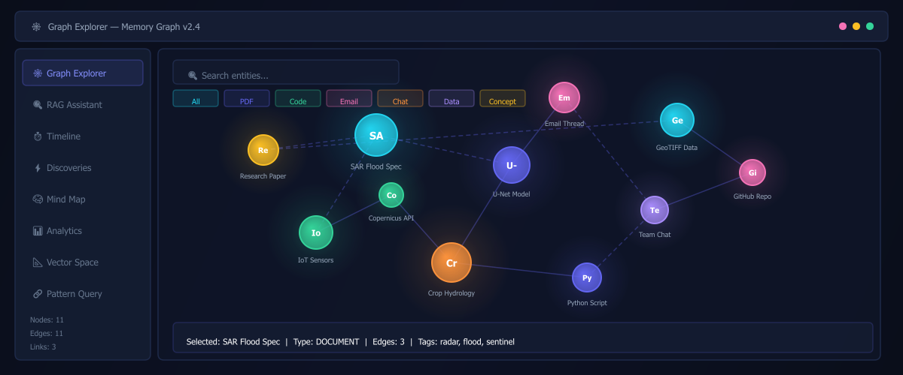
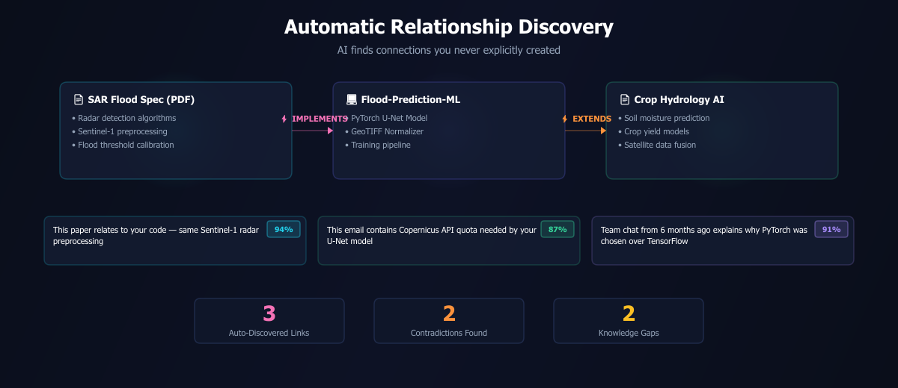
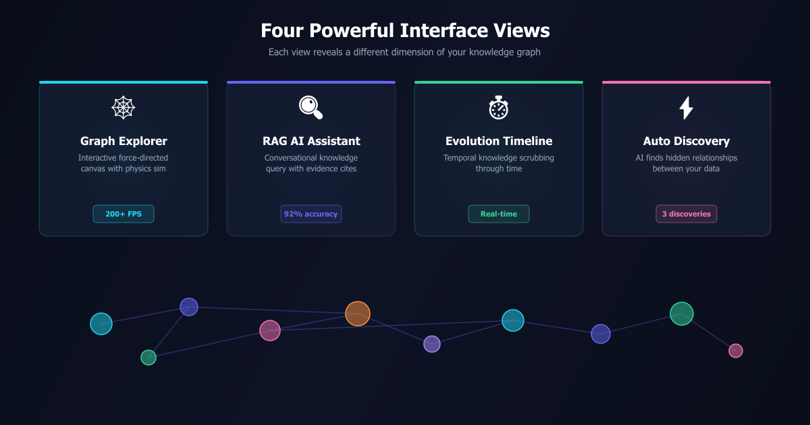
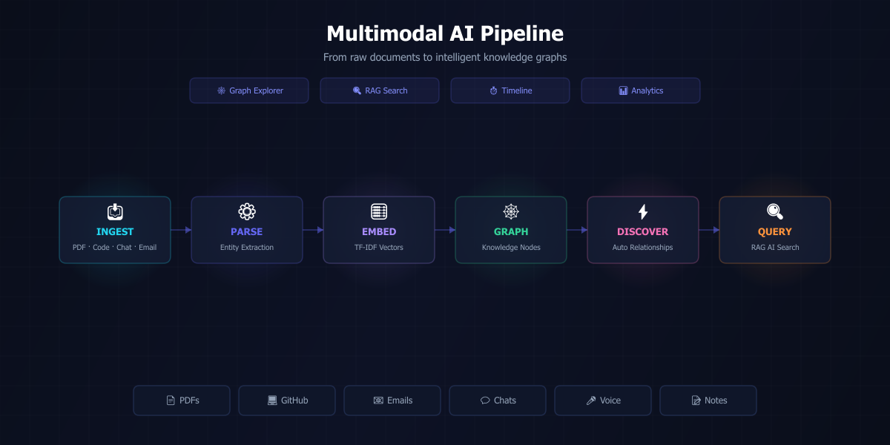
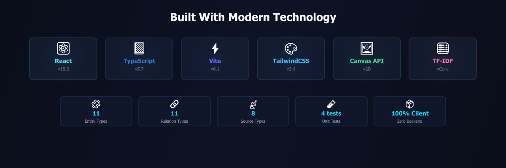
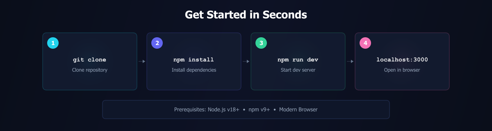

<p align="center">
  
</p>

<h1 align="center">🧠 Memory Graph</h1>

<p align="center">
  <strong>AI Knowledge Infrastructure — Don't store information. Build relationships between it.</strong>
</p>

<p align="center">
  
  
  
  
  
  
</p>

---

An AI-powered operating system for personal knowledge that continuously ingests files, code repositories, notes, and communications, extracts entity graphs, and **discovers hidden relationships** you never explicitly created.

> **Zero external AI APIs. Zero backend servers.** Everything runs in your browser using TF-IDF, cosine similarity, and force-directed graph physics.

---

## The Vision: Everything Becomes Connected

Traditional apps store information as isolated files. Memory Graph continuously extracts **People, Topics, Projects, Technologies, Concepts, Datasets, and Dates**, then connects them into a living memory network.

<p align="center">
  
</p>

<p align="center"><em>Figure 1 — The Graph Explorer: 11 nodes, 11 edges, real-time physics simulation at 200+ FPS</em></p>

---

## The Killer Feature: Automatic Relationship Discovery

Memory Graph uses **TF-IDF vector embeddings** and **cosine similarity** to automatically discover non-obvious relationships between your documents, code, emails, and notes — without you ever creating them.

<p align="center">
  
</p>

<p align="center"><em>Figure 2 — AI automatically discovers that a flood detection spec IMPLEMENTS the U-Net model, which EXTENDS crop hydrology research</em></p>

### How It Works

| Step | What Happens |
|:-----|:-------------|
| **1. Ingest** | Feed PDFs, GitHub repos, emails, chats, or notes into the system |
| **2. Extract** | AI classifies entities and generates typed relationships |
| **3. Embed** | Each node gets a TF-IDF frequency vector |
| **4. Compare** | Cosine similarity scores every pair of nodes |
| **5. Discover** | High-similarity pairs become new typed edges with confidence scores |

### Real-World Discovery Examples

> 📄 *"This research paper is related to your code because it reuses the same Sentinel-1 satellite radar preprocessing script."* — **94% confidence**

> 📧 *"This email thread contains the Copernicus API data quota required by your PyTorch U-Net model."* — **87% confidence**

> 💬 *"This team chat decision from 6 months ago explains why PyTorch was chosen over TensorFlow."* — **91% confidence**

---

## Four Powerful Interface Views

<p align="center">
  
</p>

<p align="center"><em>Figure 3 — Each view reveals a different dimension of your knowledge graph</em></p>

| View | Purpose | What Makes It Special |
|:-----|:--------|:----------------------|
| **🕸️ Graph Explorer** | Interactive 2D Force Graph | Physics simulation, shortest pathfinder, node filtering, zoom/pan |
| **🔍 RAG AI Assistant** | Conversational Knowledge Query | Subgraph traversal, evidence citations, confidence scores |
| **⏱️ Evolution Timeline** | Temporal Knowledge Scrubbing | Scrub through dates (Sep 2025 – Feb 2026), watch nodes emerge |
| **⚡ Relationship Hub** | AI Discovered Links & Insights | Auto-discovery feed, contradiction detector, knowledge gap advice |

---

## Multimodal AI Pipeline

From raw documents to intelligent knowledge graphs — all processed client-side in your browser.

<p align="center">
  
</p>

<p align="center"><em>Figure 4 — Six-stage pipeline: Ingest → Parse → Embed → Graph → Discover → Query</em></p>

### System Architecture

```
                          ┌─────────────────────────────────┐
                          │      USER INGESTION INTERFACE    │
                          │  PDF · Chat · Email · GitHub     │
                          │  Video · Notes · Web Documents   │
                          └───────────────┬─────────────────┘
                                          │
                                          ▼
                          ┌─────────────────────────────────┐
                          │   MULTIMODAL PARSER & CLEANER    │
                          └───────────────┬─────────────────┘
                                          │
                                          ▼
                          ┌─────────────────────────────────┐
                          │  AI ENTITY & CONCEPT EXTRACTOR   │
                          │  Topics, Tech, Projects, Dates   │
                          └───────────────┬─────────────────┘
                                          │
                         ┌────────────────┴────────────────┐
                         ▼                                 ▼
          ┌─────────────────────┐            ┌─────────────────────┐
          │  VECTOR EMBEDDING   │            │   GRAPH DATABASE    │
          │  TF-IDF + Cosine    │            │   Nodes & Edges     │
          └─────────┬───────────┘            └─────────┬───────────┘
                    └──────────────┬───────────────────┘
                                   │
                                   ▼
                          ┌─────────────────────────────────┐
                          │  AUTO-RELATIONSHIP DISCOVERY     │
                          │  Implicit Link Discovery Engine  │
                          └─────────────────────────────────┘
```

### Data Model

| Category | Count | Examples |
|:---------|:------|:---------|
| **Entity Types** | 11 | PROJECT, DOCUMENT, CODE, EMAIL, CHAT, CONCEPT, TECHNOLOGY, PERSON, DATASET, NOTE, VIDEO |
| **Relation Types** | 11 | RELATED_TO, IMPLEMENTS, DEPENDS_ON, SAME_TOPIC, EXTENDS, DERIVED_FROM, ... |
| **Source Types** | 8 | PDF, DOCX, GITHUB, EMAIL, CHAT, VIDEO, NOTE, WEB |
| **Pre-loaded Nodes** | 11 | Disaster management / flood prediction domain |
| **Pre-loaded Edges** | 11 | Including 3 AI-discovered relationships |

---

## Built With Modern Technology

<p align="center">
  
</p>

<p align="center"><em>Figure 5 — Six core technologies powering Memory Graph</em></p>

| Layer | Technology | Why |
|:------|:-----------|:----|
| **Framework** | React 18.3 + TypeScript 5.7 | Type-safe component architecture |
| **Build** | Vite 6.1 | Instant HMR, blazing fast builds |
| **Styling** | TailwindCSS 3.4 | Custom glassmorphism dark theme |
| **Canvas** | HTML5 Canvas 2D | Force-directed graph, vector projection |
| **AI Engine** | TF-IDF + Cosine Similarity | Zero external API dependencies |
| **Physics** | Coulomb Repulsion + Hooke Springs | Real-time graph layout simulation |

---

## Get Started in Seconds

<p align="center">
  
</p>

<p align="center"><em>Figure 6 — Four commands from clone to running application</em></p>

```bash
# Clone
git clone https://github.com/vijaymahes9080/Memory-Graph.git
cd Memory-Graph

# Install & Run
npm install
npm run dev

# Open http://localhost:3000
```

**Prerequisites:** Node.js v18+ · npm v9+ · Modern browser

---

## Feature Modules

| Module | Description |
|:-------|:------------|
| **Voice Memory Engine** | Speech-to-text transcript processing with entity extraction |
| **Taxonomy MindMap** | Hierarchical tree view organizing entities by type |
| **Graph Analytics Dashboard** | Connectivity metrics, link ratios, type distribution charts |
| **Visual Pattern Query Builder** | Construct `(Doc) -[IMPLEMENTS]-> (Code)` pattern queries |
| **Vector Space Projection** | 2D t-SNE/PCA-style semantic embedding visualization |
| **Multi-Format Exporter** | Export to JSON, Neo4j Cypher, and Obsidian Markdown Vault |
| **Graph Time Machine** | Capture, label, and compare historical graph snapshots |
| **Contradiction Detector** | Find conflicting information across documents |
| **Knowledge Gap Advisor** | Identify missing connections and recommend actions |

---

## Testing

```bash
npm run test
```

Tests cover core algorithms: data loading, BFS shortest path, document ingestion with auto-discovery, and RAG query traversal.

---

## License

Distributed under the **MIT License** — see [LICENSE](LICENSE) for details.

---

## Author

**Vijay Mahes**

- [](mailto:Vijaypradhap2004@gmail.com)
- [](https://github.com/vijaymahes9080)
