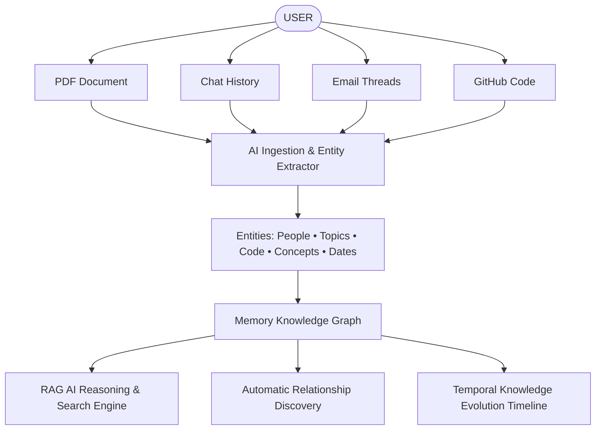

# 🧠 Memory Graph — AI Knowledge Infrastructure

> **Don't store information. Build relationships between it.**  
> An AI-powered operating system for personal knowledge that continuously ingests files, code repositories, notes, and communications, extracts entity graphs, and discovers hidden relationships.

---

<div align="center">


</div>

---

## 🌟 Core Concept: Everything Becomes Connected

Traditional apps store information as isolated files. **Memory Graph** continuously extracts entities (People, Topics, Projects, Technologies, Concepts, Datasets, Dates) and connects them into a living memory network.



---

## 🔥 The Killer Feature: Automatic Relationship Discovery

Memory Graph automatically discovers non-obvious relationships that the user never explicitly created.

```
                  ┌──────────────────────────────────────────────┐
                  │    AI DISASTER COMMAND CENTER (PDF)          │
                  │    • SAR Radar Flood Detection Spec          │
                  └──────────────────────┬───────────────────────┘
                                         │
                        ⚡ AI Auto-Discovered: IMPLEMENTS
                                         │
                                         ▼
                  ┌──────────────────────────────────────────────┐
                  │    FLOOD-PREDICTION-ML (GitHub Repo)         │
                  │    • PyTorch U-Net Model (flood_unet.py)     │
                  │    • GeoTIFF Normalizer (satellite_module.py)│
                  └──────────────────────┬───────────────────────┘
                                         │
                        ⚡ AI Auto-Discovered: EXTENDS
                                         │
                                         ▼
                  ┌──────────────────────────────────────────────┐
                  │    AGRICULTURE & CROP HYDROLOGY AI (PDF)     │
                  │    • Soil moisture & crop yield prediction   │
                  └──────────────────────────────────────────────┘
```

### Real-World Discovery Examples
- 📄 **"This research paper is related to your code because it reuses the same Sentinel-1 satellite radar preprocessing script."**
- 📧 **"This email thread contains the Copernicus API data quota required by your PyTorch U-Net model."**
- 💬 **"This team chat decision from 6 months ago explains why PyTorch was chosen over TensorFlow."**

---

## 🎨 Four Complementary Interface Views

| View | Purpose | Visual Highlights |
| :--- | :--- | :--- |
| **🕸️ Graph Explorer** | Interactive 2D/3D Force Graph | Physics repulsion loop, shortest pathfinder tool, node filtering by type, zoom/pan. |
| **🔍 RAG AI Assistant** | Conversational Knowledge Query | Subgraph traversal, evidence node citations, confidence metrics, smart prompt chips. |
| **⏱️ Evolution Timeline** | Temporal Knowledge Scrubbing | Scrub through dates (Sep 2025 – Feb 2026), watch knowledge nodes emerge sequentially. |
| **⚡ Relationship Hub** | AI Discovered Links & Insights | Discovered links feed with AI reasoning, contradiction detector, and knowledge gap advice. |

---

## 🏗️ Architecture & Multimodal Pipeline

```
                               ┌────────────────────────────────┐
                               │     USER INGESTION INTERFACE   │
                               │  PDF • Chat • Email • GitHub   │
                               │  Video • Notes • Web Documents │
                               └───────────────┬────────────────┘
                                               │
                                               ▼
                               ┌────────────────────────────────┐
                               │  MULTIMODAL PARSER & CLEANER  │
                               └───────────────┬────────────────┘
                                               │
                                               ▼
                               ┌────────────────────────────────┐
                               │   AI ENTITY & CONCEPT EXTRACTOR │
                               │  Topics, Tech, Projects, Dates │
                               └───────────────┬────────────────┘
                                               │
                                               ▼
                      ┌────────────────────────┴────────────────────────┐
                      ▼                                                 ▼
        ┌───────────────────────────┐                     ┌───────────────────────────┐
        │   VECTOR EMBEDDING INDEX  │                     │   GRAPH DATABASE STORE    │
        │ TF-IDF / Cosine Similarity│                     │   Nodes & Typed Edges     │
        └─────────────┬─────────────┘                     └─────────────┬─────────────┘
                      │                                                 │
                      └────────────────────────┬────────────────────────┘
                                               │
                                               ▼
                               ┌────────────────────────────────┐
                               │  AUTO-RELATIONSHIP DISCOVERY   │
                               │   Implicit Link Discovery Engine│
                               └────────────────────────────────┘
```

---

## 🚀 Quickstart Guide

### Prerequisites
- **Node.js** (v18.0 or higher)
- **npm** (v9.0 or higher)

### Setup & Run Locally

```bash
# 1. Clone the repository
git clone https://github.com/vijaymahes9080/Memory-Graph.git
cd Memory-Graph

# 2. Install dependencies
npm install

# 3. Start local development server
npm run dev

# 4. Build production bundle
npm run build
```

Open `http://localhost:3000` in your browser.

---

## 🧪 Comprehensive Feature Modules

- **Voice Memory Engine**: Speech-to-text transcript processing and audio entity extraction.
- **Taxonomy MindMap View**: Structured domain tree view organizing entities by type.
- **Graph Analytics Dashboard**: Density metrics, automated link ratios, and type distribution charts.
- **Visual Pattern Query Builder**: Construct visual pattern match queries `(Doc) -[IMPLEMENTS]-> (Code)`.
- **Vector Space 2D Projection**: t-SNE / PCA style visual dimensional projection of text embeddings.
- **Multi-Format Exporter**: Export memory graph to JSON, Cypher (Neo4j), and Obsidian Markdown Vault.
- **Graph Time Machine**: Capture, label, and compare historical graph snapshots.

---

## 📄 License

Distributed under the **MIT License** — see [LICENSE](LICENSE) for full details.

---

## 👤 Author & Maintainer

**Vijay Mahes**  
- Email: [Vijaypradhap2004@gmail.com](mailto:Vijaypradhap2004@gmail.com)  
- GitHub: [@vijaymahes9080](https://github.com/vijaymahes9080)
