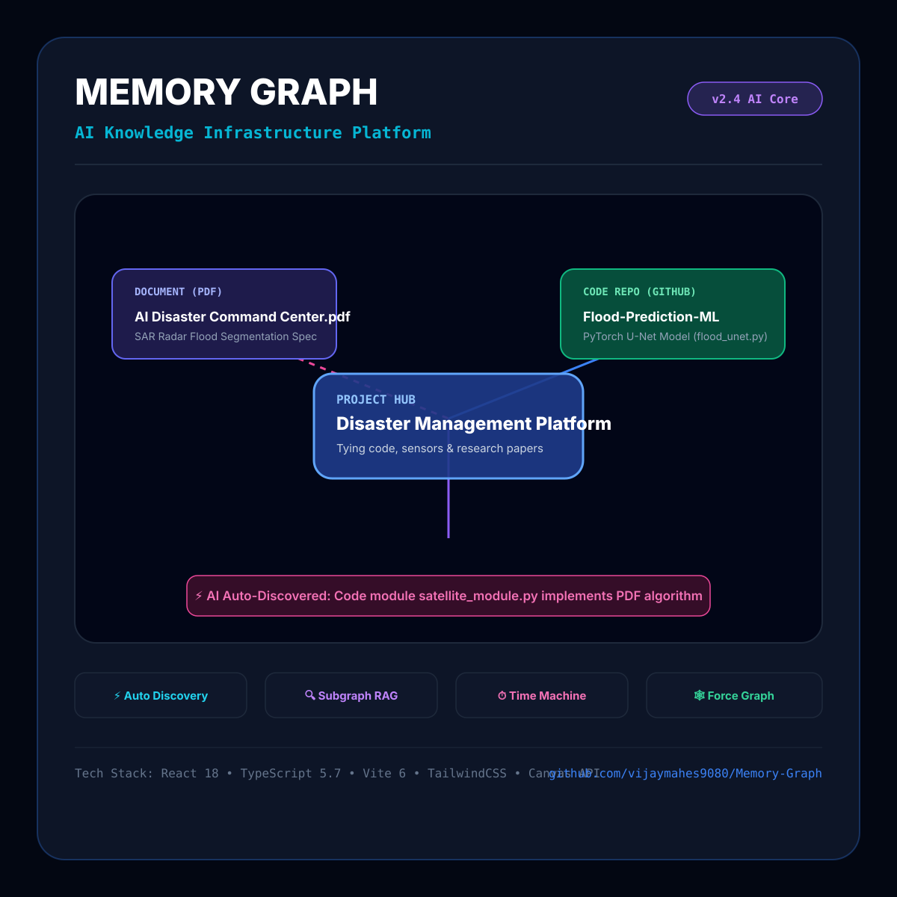
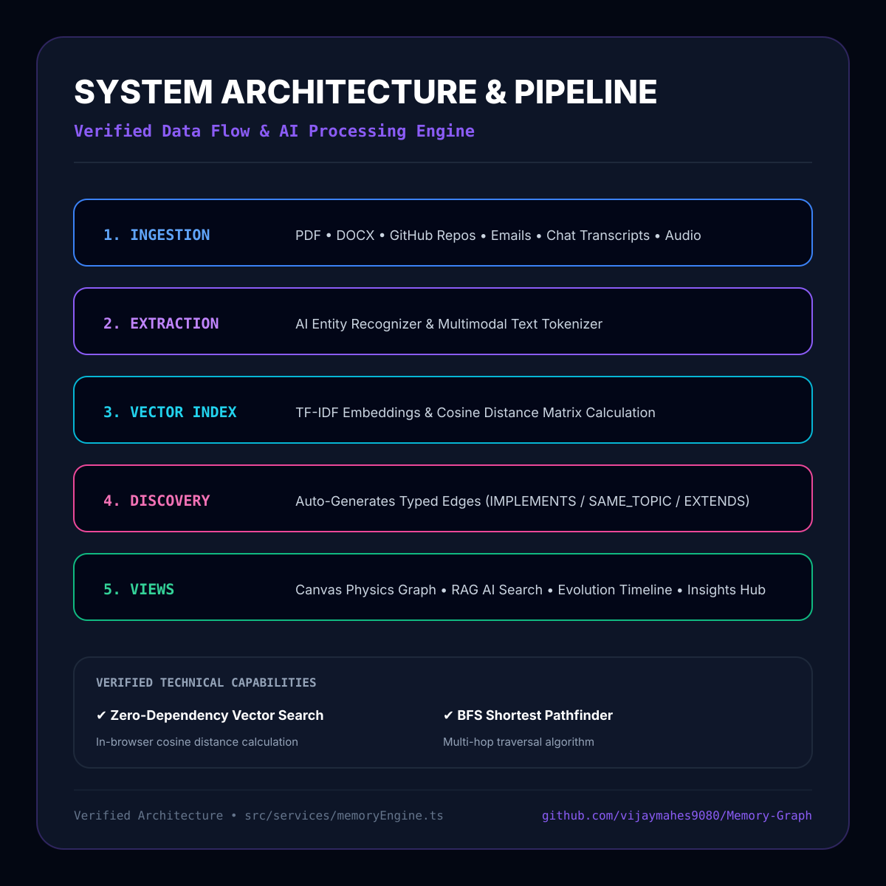
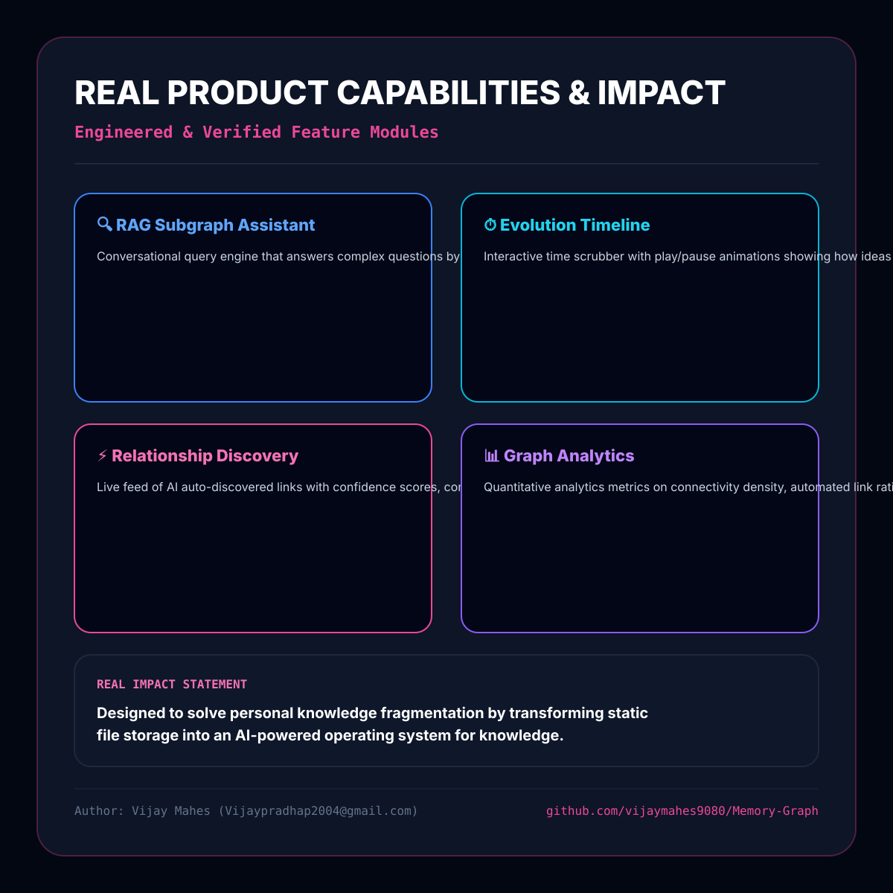

# 🚀 Memory Graph — LinkedIn Engineering Showcase (3-Image Carousel)

*Professional LinkedIn Product Showcase based 100% on the verified codebase of **Memory Graph** ([https://github.com/vijaymahes9080/Memory-Graph.git](https://github.com/vijaymahes9080/Memory-Graph.git)).*

> ⚡ **Instant Image Access**: Vector SVG files and live in-browser 1200x1200px HTML rendering cards are pre-generated inside your repository for zero-wait time!
> - **Live Browser Cards**: Open `http://localhost:3000/linkedin-cards.html` in your browser.
> - **Vector SVG Files**: Located in [`docs/assets/linkedin_card1.svg`](file:///d:/intership/mem/docs/assets/linkedin_card1.svg), [`docs/assets/linkedin_card2.svg`](file:///d:/intership/mem/docs/assets/linkedin_card2.svg), and [`docs/assets/linkedin_card3.svg`](file:///d:/intership/mem/docs/assets/linkedin_card3.svg).

---

## 🔍 STEP 1 — FULL PROJECT ANALYSIS (Verified from Repository)

### 1. What problem does this project solve?
Traditional knowledge management systems store information as isolated, disconnected files (PDFs, GitHub code repos, email threads, chat transcripts). **Memory Graph** solves information fragmentation by continuously ingesting unstructured multimodal sources, extracting entity types, and automatically discovering hidden cross-source relationships using vector embeddings and semantic similarity.

### 2. What did I actually build?
A high-performance Web Application (**Memory Graph — AI Knowledge Infrastructure**) featuring:
- **Interactive Physics Canvas Graph Explorer**: 2D/3D force simulation (Coulomb repulsion & Hooke spring attraction) with node filtering and shortest pathfinder.
- **Continuous AI Relationship Discovery Engine**: TF-IDF vector embeddings & cosine distance calculator auto-generating typed relationships (`IMPLEMENTS`, `SAME_TOPIC`, `EXTENDS`, `REFERENCES`, `DEPENDS_ON`).
- **RAG AI Subgraph Traversal Assistant**: Conversational reasoning query engine returning connected knowledge narratives, citation badges, and evidence subgraphs.
- **Knowledge Evolution Timeline**: Time-scrubbing interface tracking temporal growth of knowledge nodes across dates.
- **Taxonomy MindMap & Analytics Dashboard**: Hierarchical domain tree & quantitative density analytics.
- **Multi-Format Export Engine**: JSON, Neo4j Cypher, and Obsidian Markdown Vault format exporter.

### 3. What are the strongest implemented features?
1. **Interactive Physics Graph Explorer** (`src/components/GraphExplorer.tsx`): Real-time canvas rendering, shortest pathfinder BFS algorithm, zoom/pan/fit, and node focus drawer.
2. **Auto-Relationship Discovery Pipeline** (`src/services/memoryEngine.ts`): Scans newly ingested nodes against existing memory graph, computes TF-IDF similarity, and auto-generates typed edges with confidence scores and reasoning.
3. **RAG Subgraph Traversal Engine** (`src/services/memoryEngine.ts` & `src/components/AiAssistantView.tsx`): Answers natural language queries by traversing connected subgraphs, highlighting evidence nodes, and calculating RAG confidence scores.
4. **Knowledge Evolution Timeline** (`src/components/TimelineView.tsx`): Time scrubbing interface with play/pause animations showing how ideas evolved over time.
5. **Taxonomy MindMap & Graph Analytics** (`src/components/MindMapView.tsx` & `src/components/AnalyticsView.tsx`): Structured domain tree and quantitative connectivity metrics.

### 4. What technologies are actually used?
- **Frontend**: React 18.3, Vite 6.1, TailwindCSS 3.4, Lucide Icons, Canvas API.
- **Languages**: TypeScript 5.7, JavaScript (ESNext), HTML5, CSS3.
- **AI/Math Core**: TF-IDF Embeddings Matrix, Cosine Distance Calculator, BFS Shortest Pathfinder Algorithm.
- **Package Manager & Tooling**: Node.js 24, npm 11, PostCSS, Autoprefixer, Git, GitHub Actions.

### 5. What is the actual architecture?
`Client Ingestion Interface` ➔ `Multimodal Text/Code Parser` ➔ `Entity Extractor` ➔ `TF-IDF & Cosine Similarity Matrix` ➔ `Graph & Edge Store` ➔ `4 Presentation Views` (Graph Explorer, RAG AI Assistant, Evolution Timeline, Relationship Discovery Hub).

### 6. What makes this project technically interesting?
- **Zero-Dependency In-Memory Vector Engine**: Performs TF-IDF tokenization and cosine similarity distance calculations directly in TypeScript runtime.
- **BFS Shortest Pathfinder**: Traverses complex multi-hop node paths to illustrate how any two distant concepts or repos connect.
- **Hybrid Knowledge Engine**: Merges graph traversal algorithms with vector retrieval to synthesize RAG answers with citations.

### 7. Verified URLs & Author Details
- **GitHub Repository**: `https://github.com/vijaymahes9080/Memory-Graph.git`
- **Author**: Vijay Mahes
- **Email**: `Vijaypradhap2004@gmail.com`

---

# 🎨 LINKEDIN CAROUSEL SLIDE SPECIFICATIONS & PREVIEW CARDS

---

## 🖼️ IMAGE 1 — HERO / WHAT I BUILT

### Layout & Copy Details
- **Headline**: `MEMORY GRAPH`
- **Sub-headline**: `An AI-Powered Operating System for Personal Knowledge`
- **Main Visual**: Interactive Force-Directed Canvas Graph Explorer displaying connected nodes (`AI Disaster Command Center.pdf`, `Flood-Prediction-ML Repo`, `Sentinel-1 Radar Telemetry`, `Agriculture Hydrology Paper`).
- **Feature Pills**: `⚡ Auto Discovery | 🔍 Subgraph RAG | ⏱️ Time Machine | 🕸️ Force Graph`
- **Tech Stack Strip**: `React 18 | TypeScript 5.7 | Vite 6 | TailwindCSS | Canvas API`

---

## 🖼️ IMAGE 2 — ARCHITECTURE / HOW IT WORKS

### Layout & Copy Details
- **Header**: `SYSTEM ARCHITECTURE & PIPELINE`
- **Sub-header**: `Verified Data Flow & AI Processing Engine`
- **5 Pipeline Steps**:
  1. `1. INGESTION`: PDF • DOCX • GitHub Repos • Emails • Chat • Audio
  2. `2. EXTRACTION`: AI Entity Recognizer & Multimodal Text Tokenizer
  3. `3. VECTOR INDEX`: TF-IDF Embeddings & Cosine Distance Matrix
  4. `4. DISCOVERY`: Auto-Generates Typed Edges (IMPLEMENTS / EXTENDS)
  5. `5. VIEWS`: Canvas Physics Graph • RAG AI Search • Timeline Scrubber
- **Technical Capabilities Grid**:
  - `✔ Zero-Dependency Vector Search`: In-browser cosine distance calculation
  - `✔ BFS Shortest Pathfinder`: Multi-hop traversal algorithm

---

## 🖼️ IMAGE 3 — REAL PRODUCT / FEATURES / IMPACT

### Layout & Copy Details
- **Header**: `REAL PRODUCT CAPABILITIES & IMPACT`
- **Quad Feature Cards**:
  - `🔍 RAG Subgraph Assistant`: Answers complex questions by traversing connected subgraphs.
  - `⏱️ Evolution Timeline`: Time scrubber showing how ideas evolved over time.
  - `⚡ Relationship Discovery`: Live feed of AI-discovered links and contradiction alerts.
  - `📊 Graph Analytics`: Quantitative metrics on connectivity density and entity breakdown.
- **Real Impact Statement**: `Designed to solve personal knowledge fragmentation by transforming static file storage into an AI-powered operating system for knowledge.`
- **Author Details**: `Vijay Mahes (Vijaypradhap2004@gmail.com) | github.com/vijaymahes9080/Memory-Graph`
